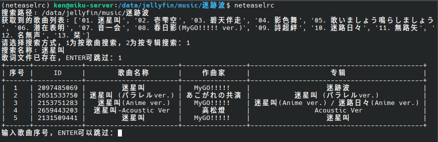
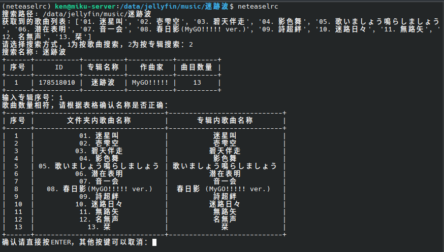

根据本地文件批量自动从网易云音乐获取并格式化歌词。

# 功能

- 通过歌曲名称或专辑名称搜索
- 可选手动指定专辑名称和作曲家，提升搜索准确性
- 通过表格查看检索到的歌曲或专辑并进行选择
- 跳过已存在歌词的文件
- 跳过纯音乐（根据文件名和返回歌词内容判断）
- 混合原始歌词和翻译歌词
- 修正可能存在问题的时间码（统一为`[xx:xx.xx]`格式）

# 使用

本项目依赖[NeteaseCloudMusicApi](https://gitlab.com/Binaryify/neteasecloudmusicapi)作为后端，你可以使用Docker快速启动一个实例：  
```bash
docker run -d -p 3000:3000 --name netease_cloud_music_api binaryify/netease_cloud_music_api
```
也可以手动安装或是通过其他方式部署，更多详细内容请参考[项目文档](https://docs-neteasecloudmusicapi.vercel.app/docs/#/?id=neteasecloudmusicapi)

接下来安装好Python并配置好虚拟环境

克隆仓库：
```bash
git clone https://github.com/Kenxu2022/neteaselrc.git
```
安装依赖：
```bash
pip install -r requirements.txt
```
切换到包含歌曲文件的路径，直接运行即可：
```bash
python /path/to/script/file
```

# 参数

传入`-d`或`--directory`可以手动指定音乐文件夹路径  
传入`-ar`或`--artist`可以手动指定作曲家  
默认情况下，歌曲所在文件夹名称会被当作专辑名称（按专辑名称搜索时会使用这一名称），你也可以通过传入`-al`或`--album`手动指定专辑  
示例：
```bash
python /path/to/script/file -d /path/to/music/folder -ar artist -al album
```
你也可以通过传入`-h`或`--help`打印这些帮助信息

# 截图

> 这里使用了`alias neteaselrc='python3 /data/dev/neteaselrc/main.py'`简化输入，墙裂推荐





# 许可证

GNU GPLv3